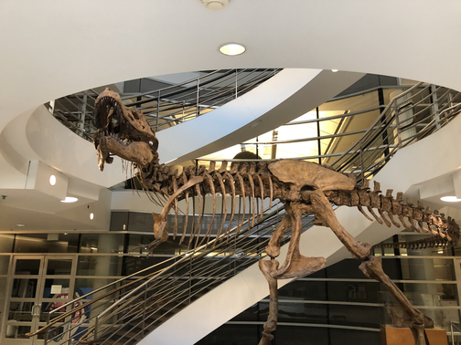
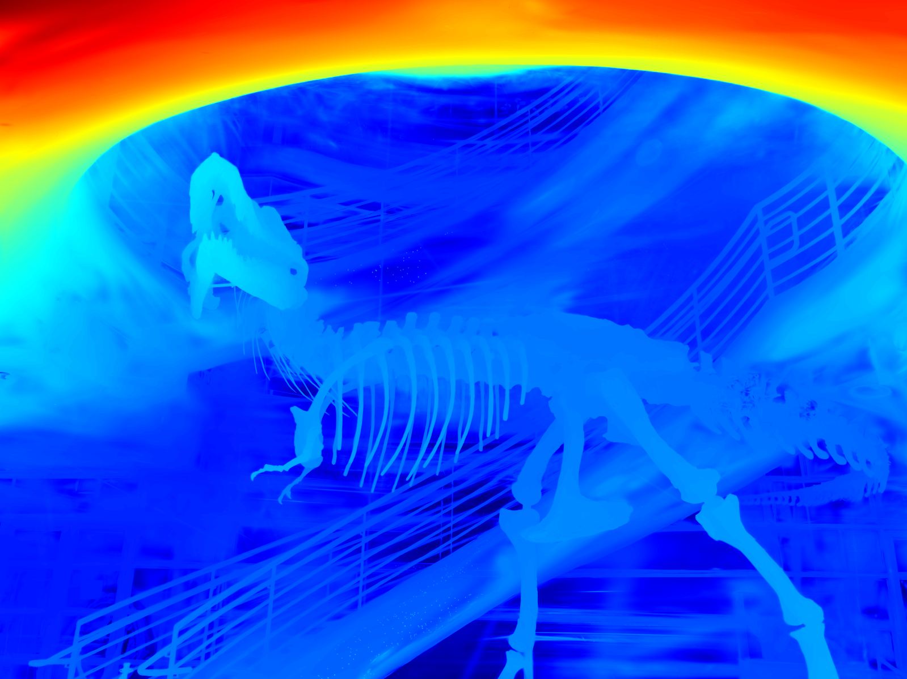
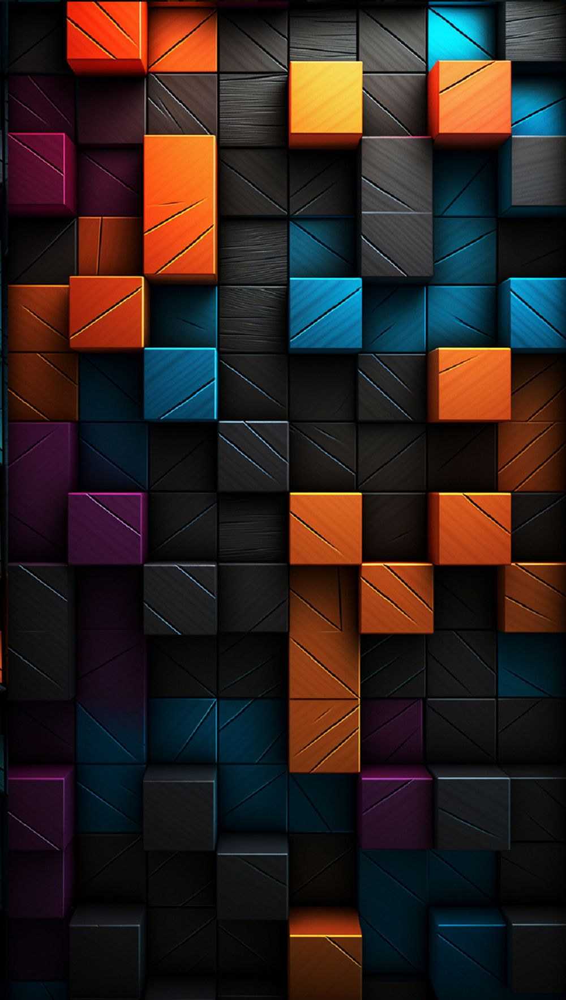
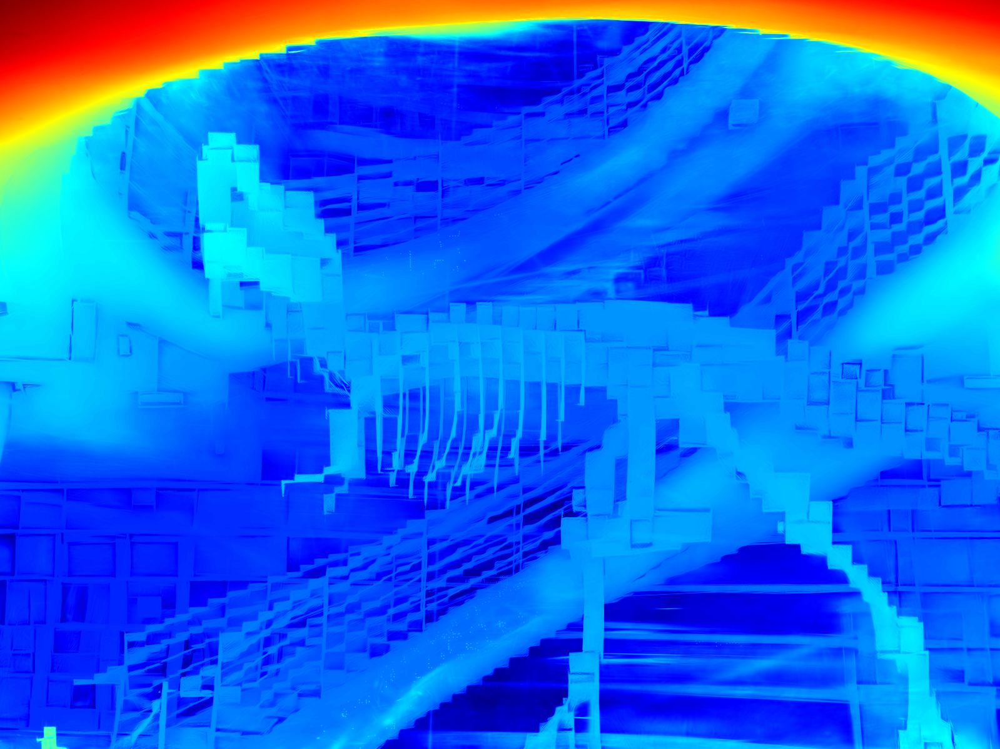
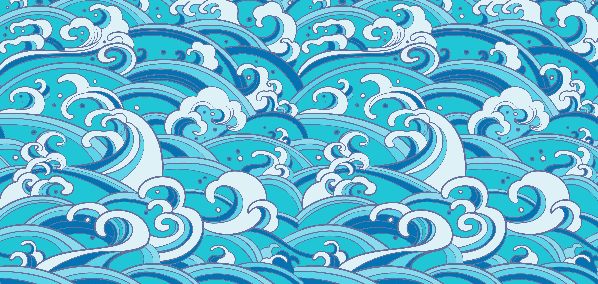
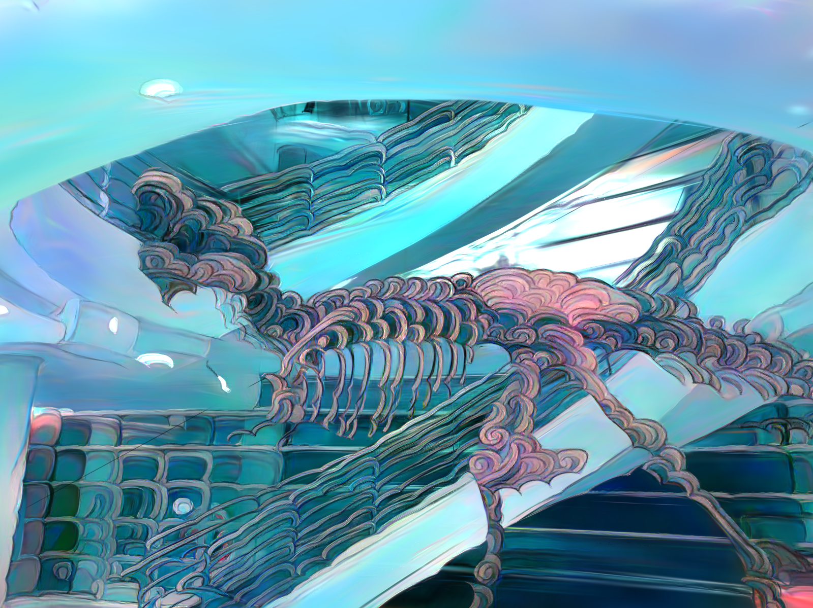
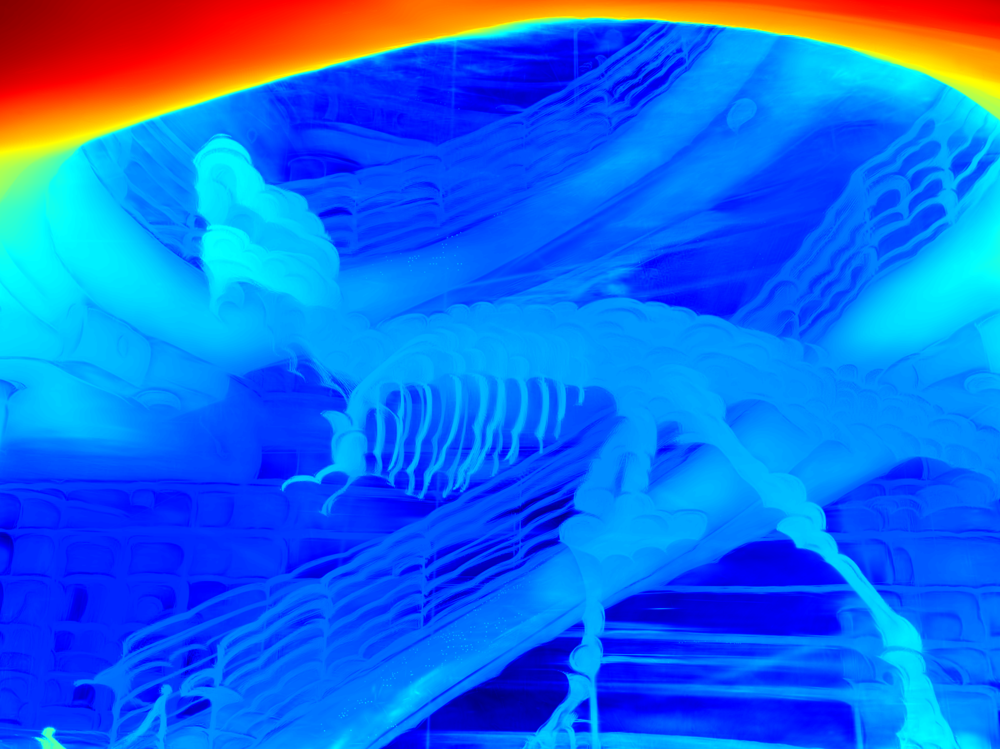

# 🎨 3D Gaussian Splatting Style & Geometry Transfer

> **3D Gaussian Splatting**에서 **style transfer**와 함께 **geometry**도 변화하는 연구 (~ing)

---

## 📖 About

본 연구는 기존 3D style transfer 방법과 달리, 스타일 이미지의 특성에 따라 **3D 장면의 기하학적 구조까지 함께 변형**시키는 새로운 접근법을 제안.

---

## 🎯 Results

### 📷 **Original Scene**

<table>
<tr>
<td width="50%">

**Original museum dinosaur scene**

</td>
<td width="50%">

**Depth map of the original scene**

</td>
</tr>
</table>

---

### 🧊 **Cube Style Transfer**

<table>
<tr>
<td width="25%">

*Reference style*

</td>
<td width="37.5%">

*Stylized result*

</td>
<td width="37.5%">

*Depth map*

</td>
</tr>
</table>

---

### 🌊 **Wave Style Transfer** 

<table>
<tr>
<td width="25%">

*Reference style*

</td>
<td width="37.5%">

*Stylized result*

</td>
<td width="37.5%">

*Depth map*

</td>
</tr>
</table>
